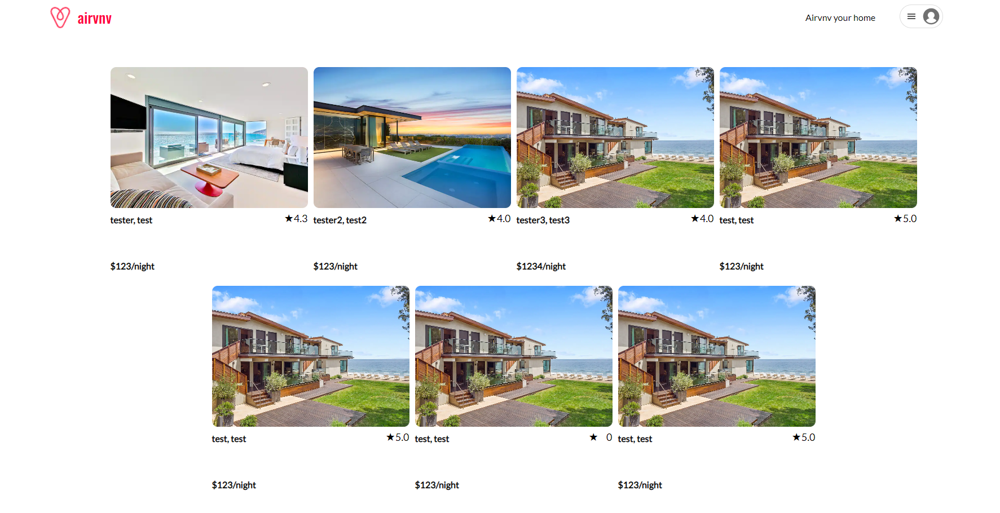

https://vian-api-project.onrender.com

This is my clone of the AirBNB website. It's been rebranded, as AirVNV (like my name).
Currently you are able to sign up, login, create, edit and delete spots, and you are also
able to create and delete reviews on each listing.

The tools that I've used are:
Javascript
PostgreSQL
Sequelize
Express
React
Redux

I am using a ripped (and flipped upside down) version of the AirBNB logo, including a replica of the dropdown menu button that I have created. Special feature that I added was an "add a review" button that will actually open the card with the textbox and additional features instead of the textbox remaining on the spot detail page.

In order to launch the site locally, you will need to do an npm install on both the backend and
frontend directories. After successfully install of the package.json, you can launch both
servers with npm install each from their own directory. (Tip: Use two different terminals)

In the near future, I will increase the capability of reviews and also add the ability to add and modify bookings.

